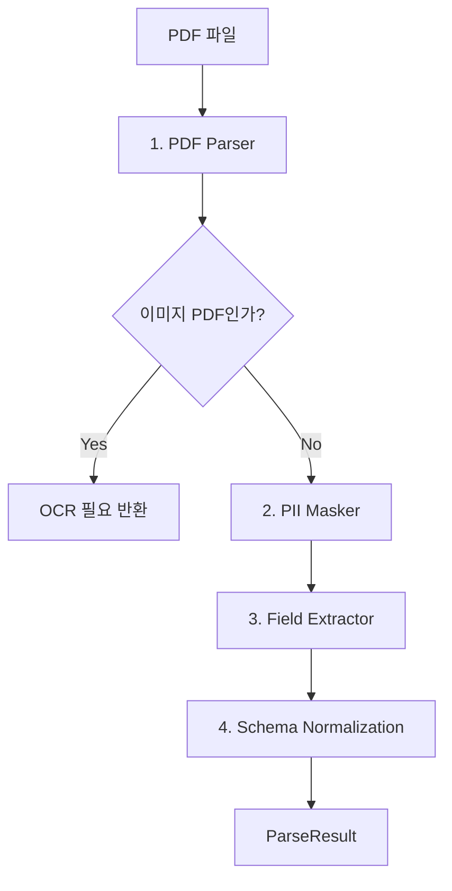

# Doc AI Service

전문적인 이력서/포트폴리오 파싱 및 데이터 구조화를 담당하는 서비스 패키지입니다.

## 개요
`doc_ai`는 비정형 PDF 문서(이력서, 포트폴리오)를 입력받아 구조화된 JSON 데이터로 변환하는 파이프라인을 제공합니다. 
OCR 필요 여부 판단, 민감 정보(PII) 마스킹, 그리고 LLM 기반 필드 추출을 단계별로 수행합니다.

## 아키텍처 (Processing Pipeline)

4단계 파이프라인으로 구성되어 있습니다:



### 1단계: PDF Parsing (`pdf_parser.py`)
- `PyMuPDF`를 사용하여 텍스트와 레이아웃(좌표) 정보를 추출합니다.
- 단순 텍스트뿐만 아니라, 문단의 위치 정보를 보존하여 LLM이 문서 구조를 더 잘 이해하도록 돕습니다.
- **OCR 감지**: 추출된 텍스트 양이 임계값 미만일 경우 이미지 기반 문서로 판단하여 처리를 중단하고 클라이언트에게 알립니다.

### 2단계: PII Masking (`pii_masker.py`)
- LLM에 데이터를 보내기 전, 개인정보(주민등록번호, 전화번호, 이메일 등)를 마스킹합니다.
- **Hybrid 접근 방식**:
    - **정규 표현식 (Regex)**: 한국어 특화 패턴 (폰번호, 주민번호 등) 처리
    - **KcBERT (Default)**: 한국어 문맥 기반 개체명 인식 (NER) 모델을 기본으로 사용
    - **Presidio Analyzer**: KcBERT 사용 불가 시 Fallback 또는 글로벌 패턴 보완

### 3단계: LLM Field Extraction (`field_extractor.py`)
- 마스킹된 텍스트와 레이아웃 정보를 LLM(Gemini)에 전달합니다.
- 프롬프트를 통해 이력서의 주요 섹션(경력, 학력, 프로젝트 등)을 구조화된 스키마로 추출합니다.

### 4단계: 후처리 및 검증
- Pydantic 모델을 사용하여 추출된 데이터의 타입을 검증합니다.
- 데이터의 채워짐 정도를 기반으로 **신뢰도 점수(Confidence Score)**를 계산합니다.

---

## 주요 컴포넌트

### `ParsePipeline` (`parse_pipeline.py`)
파싱 프로세스의 오케스트레이터입니다. 모든 하위 컴포넌트를 조율하고 최종 `ParseResult`를 반환합니다.

### `PDFParser` (`pdf_parser.py`)
PDF 파일 처리를 전담합니다.
- `ParsedDocument`: 텍스트, 블록 정보, 페이지 정보를 담는 데이터 클래스 반환

### `PIIMasker` (`pii_masker.py`)
개인정보 보호를 담당합니다. `get_pii_masker()` 팩토리를 통해 실행 환경에 맞는 마스커를 제공합니다.

### `FieldExtractor` (`field_extractor.py`)
LLM 통신 및 프롬프트 주입을 담당합니다. `ExtractedFields` 스키마에 맞춰 응답을 파싱합니다.

---

## 사용 예시

```python
import asyncio
from services.doc_ai.parse_pipeline import ParsePipeline

async def main():
    # 파이프라인 초기화
    pipeline = ParsePipeline()
    
    # PDF 파일 파싱
    result = await pipeline.parse("path/to/resume.pdf")
    
    if result.success:
        print(f"이력서 제목: {result.extracted_fields.title}")
        print(f"신뢰도: {result.confidence_score}")
        
        # 경력 사항 출력
        for exp in result.extracted_fields.work_experience:
            print(f"- {exp.company_name}: {exp.role}")
            
    elif result.needs_ocr:
        print("이미지 PDF입니다. OCR 처리가 필요합니다.")
        
    else:
        print(f"파싱 실패: {result.error_message}")

if __name__ == "__main__":
    asyncio.run(main())
```

## 의존성 (Dependencies)

이 서비스는 다음 라이브러리들에 의존합니다:
- `pymupdf`: PDF 처리
- `presidio-analyzer`, `presidio-anonymizer`: PII 감지 및 마스킹
- `pydantic`: 데이터 검증
- `google-generativeai` (또는 관련 LLM 클라이언트): 필드 추출

### PII 모델 다운로드
Presidio 사용 시 필요한 spacy 모델 다운로드가 필요할 수 있습니다:
```bash
python -m spacy download en_core_web_lg
```
